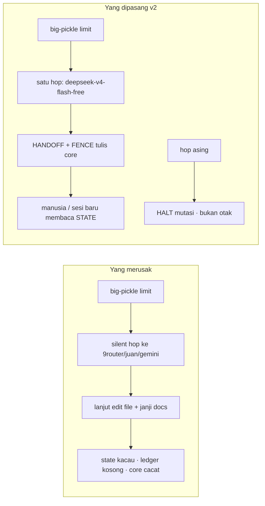

# Perbaikan Inti Niumination — v2

| Field | Nilai |
|---|---|
| **Objek** | CORE ekosistem, bukan website/app |
| **Snapshot** | 2026-08-18 18:45 WIB · `up-eco.sh v5.1` |
| **Mesin** | MacBookPro16,2 · Intel 4C · 16 GB |
| **Otak yang ada** | OpenCode Zen free: `big-pickle`, `deepseek-v4-flash-free` |
| **Penyakit** | Model lemah + ganti model diam-diam + dokumentasi hanya di chat |
| **Obat** | Hukum tersegel · pagar tanpa LLM · ledger no-agent · satu keluarga model |
| **Errata v1** | `ERRATA-AUDIT-V1.md` — fallback 9router dan multi-agen **ditarik** |

---

## 0. Diagnosis yang benar

Hermes **selalu** bergantung pada model. Niumination **tidak punya** model kuat. Yang dipakai hampir selalu free tier Zen. Ketika kuota habis, Hermes (dan 5 thread Telegram di 9router) pindah otak — `agnes-2.0-flash`, `gratislonggar`, `gemini-3`, `gemma-4`, `cf/zai`, `cf/deepseek` — lalu **melanjutkan tugas seolah dunia tidak berganti**.

Itu bukan “resilience”. Itu mesin cacat.

Akibat yang sudah terlihat di snapshot:

| Gejala | Bukti | Akar |
|---|---|---|
| Dokumentasi perkembangan hilang | `docs/` hanya 364 KB vs `AGENTS.md` 53.7 KB esai yang model lemah tidak patuhi; BACKLOG macet 29 Jul | Model janji “nanti dicatat”, chat dianggap arsip |
| Core premature / makin cacat | `orchestrator` 40% stale, `Ultra` 80% stale, 1 active agent, MC `:5200` down | Multi-agen dan control plane dibangun seolah modelnya kuat |
| Kesalahan menumpuk saat ganti model | Fallback as-is: `juan-router` (401) → 9router cf-deepseek → `gratislonggar`; Telegram zoo 5 model | Tidak ada HANDOFF, tidak ada fence tulis |
| Identitas tidak stabil | 53.7 KB DOX + 4 karakter + 213 skill USB + 2 skill HOME | Lemah model = tidak bisa memegang kontrak panjang |

Website (`kune-ya.com` timeout, `niu-vermilion` 307) **bukan inti**. Mereka satelit. Membetulkan satelit tidak menyembuhkan core.



---

## 1. Visi & misi (tidak boleh diacak model)

Tertulis tersegel di `core/VISION.md` dan `core/CONSTITUTION.md`. Ringkas:

**Visi.** Ekosistem kerja yang tidak bergantung pada kecerdasan model yang sedang online. Model tenaga sewaan. Hukum, memori, catatan milik Niumination.

**Misi, berurutan:**

1. Jaga inti utuh (hukum, state, ledger, skill bank, brain).
2. Tangkap pengetahuan sebelum hilang — file, bukan chat.
3. Bekerja jujur dengan dua model Zen free. Jangan pura-pura kuat.
4. Baru kemudian kerjakan satelit jika manusia menyebut namanya.

**12 hukum** (lemah-model-readable) ada di konstitusi. File itu `chmod a-w`. Plugin/hook memblokir setiap usaha menimpa.

---

## 2. Peta bersih — core vs satelit

```
/Users/zaryu/Desktop/Niumination/
├── core/                 ★ HUKUM + STATE + LEDGER     ← ini jantung
├── brain/                ★ memori jangka panjang
├── skills/               ★ 47 SKILL.md SoT
├── scripts/              ★ otomasi no-agent
├── docs/                 ★ dokumentasi terpadu
├── agents/_shared/       ★ PATHS + INCIDENT
├── AGENTS.md             ★ slim ≤ 2 KB (backup 53.7 KB)
├── vault/                🔒 manusia saja
│
├── apps/ sites/ desktop/ labs/ sandbox/ archive/   ← SATELIT
├── agents/characters|Ultra|orchestrator|profile    ← DORMANT
└── services/niu-mission-control                    ← infrastruktur, bukan jiwa
```

Agen default **buta** terhadap satelit sampai manusia menulis nama proyek di pesan itu. Ini yang menghentikan “model lemah merapikan semuanya” dan merusak core.

---

## 3. Kebijakan model (inti perbaikan)

| Boleh berpikir | Tidak boleh berpikir |
|---|---|
| `opencode-zen/big-pickle` | seluruh 9router (`gemini`, `gemma`, `gratislonggar`, `cf/*`) |
| `opencode-zen/deepseek-v4-flash-free` | `juan-router/agnes-2.0-flash` |
| | `huancheng/*` · `agentrouter/*` |

`9router :20128` boleh tetap hidup sebagai **pipa**. Bukan otak.

Perilaku:

| Peristiwa | Sistem (tanpa LLM) | Model |
|---|---|---|
| 429/5xx di pickle | fallback **satu** kaki: `deepseek-v4-flash-free` | — |
| Kaki itu aktif | tulis `core/runtime/HANDOFF.md`, `fence.active=true` | baca handoff, jangan mutasi core |
| Model asing terdeteksi | HALT semua tool tulis | “kamu bukan otak” |
| Kedua Zen gagal | berhenti. Jangan hop | tunggu kuota / manusia |
| Manusia puas handoff | `python3 scripts/niu-handoff.py --clear` | sesi baru boleh mutasi lagi |

Ini membalik rekomendasi v1. v1 menyembuhkan limit dengan zoo model. Zoo itulah yang membuat ekosistem premature.

Telegram thread `1, 802, 803, 804, 1172` harus `/model opencode-zen:big-pickle`. Lihat `core/TELEGRAM-UNIFY.md`.

---

## 4. Dokumentasi yang tidak bisa “terlewat”

Model lemah gagal menulis esai. Jadi dokumentasi **tidak diminta dari model** sebagai syarat berhasil.

| Mekanisme | Kapan | Isi |
|---|---|---|
| Hook `on_session_end` | setiap sesi selesai | `core/ledger/sessions/YYYY-MM-DD.jsonl` |
| `niu-doc-capture.py` | manual / cron no-agent | git status, diffstat, HEAD, fence |
| Formulir `DECISION.yaml` | keputusan | YAML pendek, manusia `sealed` |
| HANDOFF | ganti model | YAML, diarsip ke `ledger/handoffs/` |
| `brain-daily-report` | 23:00 no-agent | tetap — jangan di-LLM-kan |

Chat Telegram **bukan** arsip. Jika tidak ada baris di ledger, sesi itu secara resmi tidak terjadi bagi core.

---

## 5. Yang dibangun (perbaikan, bukan saran)

Uji pagar: `python3 scripts/test_niu_corelib.py` → **ALL PASS**.

| Artefak | Fungsi |
|---|---|
| `core/CONSTITUTION.md` | 12 hukum tersegel |
| `core/VISION.md` | visi/misi tersegel |
| `core/SCOPE.md` | core vs satelit |
| `core/MODEL.policy.yaml` | dua otak, halt selain itu |
| `core/FREEZE.list` | daftar file yang tidak boleh disentuh |
| `core/STATE.yaml` | papan tulis mesin |
| `core/LEDGER.md` + `templates/` | arsip + formulir |
| `core/AGENTS.slim.md` | pengganti 53.7 KB |
| `core/TELEGRAM-UNIFY.md` | satukan 5 thread |
| `hermes/SOUL.md` + `USER.md` | identitas pendek |
| `hermes/plugins/niu-core-fence/` | blokir tulis + deteksi ganti model |
| `hermes/agent-hooks/niu-*.py` | hook stdin JSON (cadangan plugin) |
| `scripts/niu_corelib.py` | mesin pagar, tanpa LLM |
| `scripts/niu-handoff.py` | tulis/turunkan fence |
| `scripts/niu-doc-capture.py` | ledger no-agent |
| `scripts/niu-seal-core.sh` | `chmod a-w` hukum |
| `scripts/niu-core-install.sh` | pasang ke `$NIU` + `~/.hermes` |
| `configs/config.yaml.target-excerpt.yaml` | fallback **hanya** flash-free |

Karakter `arsitek/pembangun/pengawas/penjaga`, `Ultra`, `orchestrator`: **tidak dihidupkan**. Folder tetap arsip. Menghidupkannya sekarang mengulang cacat.

---

## 6. Pelaksanaan di Mac `zaryu`

```bash
export NIU=/Users/zaryu/Desktop/Niumination
# salin folder niumination-rebuild ke Mac, lalu:
bash scripts/niu-core-install.sh

# pin cron yang ERROR (tetap berlaku dari v1)
hermes cron edit c6ec80ed633f --provider opencode-zen --model big-pickle

# fallback: buang zoo, sisakan satu kaki Zen
hermes fallback ls
# hapus juan-router / 9router / huancheng
hermes fallback add --provider opencode-zen --model deepseek-v4-flash-free

# enable plugin (jangan cabut rtk-rewrite)
# plugins.enabled: [rtk-rewrite, niu-core-fence]

# setiap thread Telegram:
#   /model opencode-zen:big-pickle

python3 $NIU/scripts/niu-doc-capture.py --note bootstrap-core-v2
python3 $NIU/scripts/niu-handoff.py --status
```

Consent hook pertama kali: `HERMES_ACCEPT_HOOKS=1` atau `hermes hooks` sesuai CLI.

Jangan:

- `cron.model_drift_guard false`
- `/model` ke 9router/juan/gemini “supaya tetap jalan”
- enable `telegram_router`
- hidupkan 4 karakter
- Docker-kan Mission Control di 16 GB
- menyuruh model “rapihkan seluruh ekosistem”

MC `:5200` boleh dinyalakan nanti sebagai **instrumen**, setelah hukum dan fence hidup. Bukan syarat jiwa.

---

## 7. Definisi core sehat (14 hari)

Berlaku **bersamaan**:

1. `CONSTITUTION.md` / `VISION.md` / `MODEL.policy.yaml` / `SOUL.md` tidak berubah kecuali oleh `zaryu`.
2. Setiap ganti model meninggalkan `ledger/handoffs/*` dan fence; tidak ada commit agen ke file beku.
3. `ledger/sessions/*.jsonl` terisi tanpa LLM pada hari ada sesi.
4. Lima thread Telegram berpikir di keluarga Zen, bukan zoo 9router.
5. `fallback_providers` hanya `opencode-zen/deepseek-v4-flash-free`.
6. Tidak ada runtime multi-agen.

Sampai itu hijau: jangan menambah provider, jangan membangunkan satelit “sekalian”, jangan menulis ulang `AGENTS.md` menjadi esai.

---

*v2 menggantikan rekomendasi arsitektur di `AUDIT-REKONSTRUKSI-HERMES-2026-08-18.md`. Observasi snapshot di dokumen itu tetap sah. Errata: `ERRATA-AUDIT-V1.md`.*
