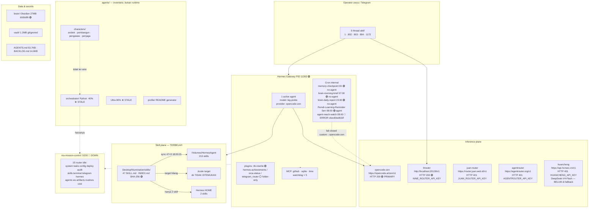
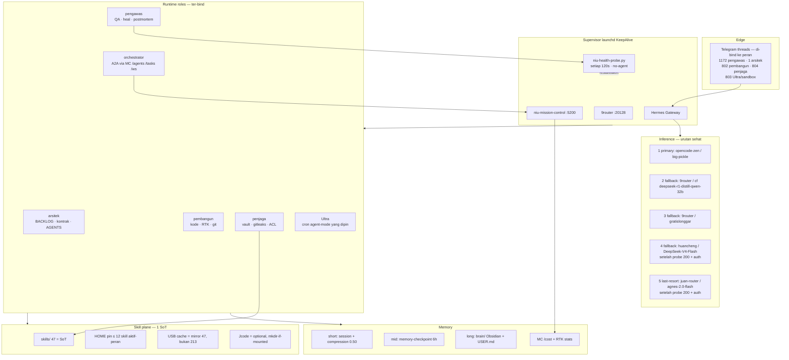
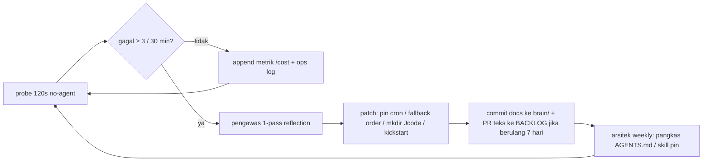

# Audit & Blueprint Rekonstruksi — Ekosistem Hermes Agent (Niumination)

> **DISUPERSEDE (arsitektur).** Observasi snapshot di dokumen ini tetap sah.
> Rekomendasi fallback 9router / multi-agen / bind 5 thread **ditarik**.
> Pakai: `CORE-REPAIR-2026-08-18.md` + `ERRATA-AUDIT-V1.md`.

| Field | Nilai |
|---|---|
| **Subjek** | Niumination + Hermes Agent (snapshot `up-eco.sh v5.1`) |
| **Mesin** | MacBookPro16,2 · Intel 4C · 16 GB · macOS 26.5 (25F71) |
| **Snapshot** | 2026-08-18 18:45 WIB |
| **Operator** | `zaryu` · write-path sah: `/Users/zaryu/Desktop/Niumination` **atau** `/Volumes/HermesAgent` |
| **Git root** | `ecosystem-config` `4e773e8` · **2 file dirty** |
| **Klasifikasi** | Control-plane down · skill-plane drift · cron fail-closed · orkestrasi stale |
| **Verdict** | Ekosistem **kaya aset, miskin kendali**. Bukan kekurangan tool — kekurangan *control loop* yang hidup. |

Dokumen ini merujuk variabel, path, job, router, dan peran yang tercatat di snapshot — bukan template generik. Perintah yang memakai `hermes config` / `hermes cron` adalah satu-satunya jalur tulis konfigurasi yang sah (write-protection aktif).

---

## 0. Ringkasan Eksekutif

Niumination sudah punya hampir semua komponen *production-grade*: Skill Bank 47 (`INDEX.md` + manifest SHA-256 sinkron), RTK 0.45.0 yang menyelamatkan **6.3M token (68.6%)**, Gateway hidup (PID `11393`, Telegram connected), 5 thread Telegram aktif, 15 router Mission Control, 4 karakter agen, dan cron harian untuk `brain/`. Yang **tidak** hidup adalah lapisan yang menyatukan semuanya.

Tiga temuan yang menentukan arsitektur ulang:

1. **Control plane mati.** `niu-mission-control` port `5200` tidak merespons. 15 router (`system`, `tasks`, `config`, `deploy`, `audit`, `skills`, `terminal`, `telegram`, `hermes`, `agents`, `ws`, `artifacts`, `routines`, `cost`) idle. Hermes terbang tanpa instrumen — cost, agent roster, dan routine tak terobservasi.
2. **Orkestrasi ada di kertas, stale di disk.** `agents/characters/{arsitek,pembangun,pengawas,penjaga}` + `agents/orchestrator` (40% P3 stale) + `agents/Ultra` (80% P3 stale). Gateway hanya mencatat **1 active agent**. Multi-agent adalah inventaris, bukan runtime.
3. **Skill-plane terbelah tiga.** Bank pusat 47 · Hermes USB 213 · Hermes HOME 2 · target Jcode hilang. Sumber kebenaran sudah ada (`skills/` + `INDEX.md`); runtime tidak memakainya secara disiplin.

Delapan open issue snapshot **bukan delapan masalah terpisah**. Mereka adalah gejala satu pola: *tidak ada supervisor yang menutup loop* ketika state menyimpang dari konfigurasi.

| # | Open issue (snapshot §11) | Kelas akar | Prioritas |
|---|---|---|---|
| 1 | Mission Control `:5200` DOWN | Control-plane / SPOF | P0 |
| 2 | Ecosystem root 2 file dirty | Drift / hygiene | P1 |
| 3 | Cron `agent-reach-watch` ERROR (`c6ec80ed633f`) | Config drift guard (by design) | P0 |
| 4 | `kune-ya.com` timeout | Deploy edge | P1 |
| 5 | `niu-vermilion` 307 | Deploy edge | P2 |
| 6 | Jcode skills dir missing | Skill-sync target | P1 |
| 7 | 3 plugin folder tidak di-enable | Config drift | P2 |
| 8 | Huancheng belum di `fallback_providers` | Resilience gap | P1 |

---

## 1. Audit & Pemetaan Kondisi Eksisting

### 1.1 Topology Map — as-is (18:45 WIB)



Alur kerja aktual (bukan yang tertulis di `AGENTS.md`):

```
Telegram thread ──► Gateway (1 agent) ──► opencode-zen / big-pickle
                         │
                         ├─ thread 1,802,803,804,1172 ──► 9router :20128  (SPOF lokal)
                         ├─ RTK rewrite ──► hemat 68.6% token tool-output
                         ├─ cron no-agent ──► brain/ + memory  (sehat)
                         └─ cron agent-reach-watch ──► SKIP (drift guard)
Mission Control :5200 ── X  (tidak ada metrik, tidak ada dispatch, tidak ada cost loop)
orchestrator / Ultra / 4 karakter ── X  (kode di disk, 0 eksekusi)
```

### 1.2 Inventory runtime vs disk

| Lapisan | Ada di disk | Hidup di runtime 18:45 | Selisih |
|---|---|---|---|
| Hermes Gateway | ya | PID `11393`, Telegram 🟢 | — |
| Active agents | 4 karakter + Ultra + orchestrator + profile | **1** | 6 peran tidak di-bind |
| Mission Control | `services/niu-mission-control` · 15 router · Docker · tests | **DOWN** | control plane = 0 |
| Skill Bank | 47 valid, INDEX sinkron, 267 file | sync 18:00:21 ke 3 target | HOME=2, USB=213, Jcode=0 |
| Plugin | 4 folder | 1 enabled (`rtk-rewrite`) | 3 mati / tidak diputuskan |
| Provider | 5 terdaftar | 2 LIVE (zen, 9router); 3×401 tanpa auth di probe | fallback chain salah urutan |
| Cron | 5 job | 4 OK · 1 ERROR | `c6ec80ed633f` unpinned |
| MCP | github, sqlite, time, watchdog×5 | terpasang | watchdog×5 = 5 proses di Intel 4C |
| Deploy edge | 6 target dicek | 3 OK · 2 bermasalah · 1 307 | kune-ya, vermilion |
| Git | 3 repo | 1 dirty (root) | 2 file uncommitted |

### 1.3 Gap Analysis — bottleneck, tumpang-tindih, dependensi rentan

#### G1. Control plane putus (bottleneck #1)

`niu-mission-control` adalah satu-satunya permukaan yang mengikat Hermes ke sisa ekosistem: router `hermes`, `agents`, `telegram`, `tasks`, `routines`, `cost`, `skills`, `audit`. Server down berarti:

- tidak ada health dashboard untuk 5 thread Telegram;
- router `cost` tidak mencatat pemakaian token di luar statistik RTK lokal;
- `swarm/` + `fusion/` + `modules/` di tree MC tidak bisa men-dispatch karakter;
- redesain v3 backend **selesai**, frontend Phase 5B–5C **belum** — bahkan backend yang sudah jadi pun tidak dijalankan.

Start yang disarankan snapshot (`python3 server.py`) adalah *manual, non-persistent*. Di MacBook Intel 16 GB yang tidur, ini dijamin down lagi setelah lid-close.

#### G2. Multi-agent adalah inventaris, bukan sistem

```
agents/
├── characters/arsitek      # desain, BACKLOG, kontrak antarmuka
├── characters/pembangun    # implementasi, RTK, git
├── characters/pengawas     # QA, health, self-heal
├── characters/penjaga      # vault, gitleaks, ACL tulis
├── orchestrator/           # 40% P3 ⏸️ — seharusnya A2A bus
├── Ultra                   # 80% P3 ⏸️ — seharusnya cron/automation
└── profile/                # README generator — satelit, bukan runtime
```

Tanpa `orchestrator` yang mem-publish tugas ke router `agents` + `tasks` + `ws`, keempat karakter tidak punya saluran. Gateway “1 active agent” mengonfirmasi: semua thread Telegram menabrak **satu** persona + `AGENTS.md` 53.7 KB.

#### G3. Skill-plane split-brain

| Store | Jumlah | Peran yang *seharusnya* | Peran aktual |
|---|---:|---|---|
| `Desktop/Niumination/skills/` | 47 | **Source of truth** | Benar — INDEX + SHA-256 sinkron |
| Hermes USB | 213 | Cache/runtime subset yang di-pin | Dump Skills Hub — 4.5× lebih besar dari bank |
| Hermes HOME | 2 | Runtime pin untuk sesi interaktif | Hampir kosong — agent “buta skill” di HOME |
| Jcode | 0 | Target sync #3 | Path `/Volumes/HermesAgent/.cache/unix-home/.jcode/skills` tidak ada |

Konsekuensi: prompt yang mengandalkan skill bank (47, domain `software-development:30`) **tidak dijamin ter-load** di sesi Hermes HOME. USB membawa 213 skill → context pollution jika suatu sesi mem-pin USB sebagai skill root. Sync 18:00:21 “47 × 3 target” secara teknis gagal diam-diam pada kaki Jcode.

#### G4. Fallback chain terbalik terhadap health probe

```yaml
# as-is (snapshot §8)
fallback_providers:
  - juan-router / agnes-2.0-flash          # probe HTTP 401
  - 9router / cf/@cf/deepseek-ai/deepseek-r1-distill-qwen-32b   # 9router LIVE
  - 9router / gratislonggar                # 9router LIVE
# huancheng / DeepSeek-V4-Flash            # KEY ADA, TIDAK di chain
```

Dokumen resmi Hermes: **401/403 memicu fallback segera, tanpa retry**. Urutan sekarang = setiap kegagalan primary `opencode-zen` *pasti* menabrak `juan-router` 401 dulu (latensi + noise log), baru ke 9router yang sebenarnya sehat. `agentrouter` terdaftar di `providers:` tapi tidak di chain dan tidak di primary — dead config. Huancheng (kunci ada di `.env`) hanya bisa diaktifkan manual `/model`.

#### G5. Context tax `AGENTS.md` 53.7 KB

53.7 KB ≈ 12–15k token *setiap* turn, di mesin 16 GB, di 5 thread Telegram + 1 agent. Ditambah USB 213 skills jika tersentuh. RTK menyelamatkan **output tool** (6.3M, 68.6%, top command `rtk grep` 323× / 3.9M), tetapi tidak menolong **system prompt statis**. Ini kebocoran biaya terbesar yang tidak terlihat di scoreboard proyek.

#### G6. MCP `watchdog × 5` di Intel 4C / 16 GB

Lima proses watchdog + Gateway + 9router `:20128` + (seharusnya) MC `:5200` + Obsidian `brain/` + 5 thread. Di 4 core ini sudah melewati anggaran proses untuk laptop yang juga menjalankan `niu-cast`, `didong-code`, dan browser. Watchdog yang tidak ter-rollup ke satu supervisor = observasi terduplikasi tanpa tindakan (MC down tidak terselamatkan).

#### G7. Volume & write-path trap

| Mount | FS | Tulis | Risiko agen |
|---|---|---|---|
| `/` | APFS | ❌ | — |
| `/System/Volumes/Data` | APFS | ✅ | path user OK |
| `/Users/zaryu/Desktop/Niumination` | APFS (Data) | ✅ | **root kerja sah** |
| `/Volumes/HermesAgent` | ExFAT USB | ✅ | no POSIX ACL, risiko korupsi, bisa unmount |
| `/Volumes/Mac Win` | ExFAT | ✅ | bukan workspace agen — harus di-deny |
| `/Volumes/Windows X-Lite` | NTFS | ❌ | write error jika agen “iseng” |
| `/Volumes/Niumination` | NTFS | ❌ | nama menyesatkan — **bukan** root ekosistem |

Agen yang membaca label “Niumination” di `/Volumes/Niumination` akan gagal tulis. JHermUSB-portable + skill USB hidup di ExFAT — tidak ada permission bit, tidak ada snapshot APFS.

#### G8. Scoreboard vs filesystem — proyek yang mengisap perhatian

BACKLOG terakhir **29 Jul 2026** (20 hari sebelum snapshot). Drift dokumentasi:

| Sinyal | Fakta |
|---|---|
| `orchestrator` 40% stale | A2A bus tidak jalan — langsung terkait G2 |
| `Ultra` 80% stale | automasi cron “pintar” tidak diganti, hanya cron built-in |
| `Flame-ADE` v1.3.0 stale | desktop, bukan blocker Hermes |
| sandbox 7 proyek / 202 MB dormant | aman diabaikan runtime; jangan di-index skill |
| archive `niuterm` 621 MB + `terax-ai` 216 MB | jangan masuk workspace agent |
| `Niu-Flow` 90% **remote only** | dependensi di luar laptop — tidak ada health di MC |
| `ai-first-os` 45% minor | noise BACKLOG |

#### G9. Plugin drift

Folder plugins = 4, config = 1. Ini bukan “fitur cadangan”; ini *undecided surface*. `telegram_router` (Aug 9) berpotensi bentrok dengan Gateway Telegram yang sudah 🟢. `orca-status` kemungkinan observasi — tepat untuk self-heal **jika** tidak menduplikasi watchdog×5. `hermes-achievements` adalah noise produksi.

#### G10. Deploy edge tidak masuk control loop

`kune-ya.com` timeout dan `niu-vermilion` 307 terdeteksi `up-eco.sh`, tetapi tidak ada job Hermes yang mengejar. Router MC `deploy` idle. Cron tidak punya canary HTTP.

### 1.4 Security & Reliability Review

#### 1.4.1 Temuan keamanan

| ID | Temuan | Severity | Bukti snapshot |
|---|---|---|---|
| S1 | Secret di `.env` (5 key provider) + `vault/` (android-signing, `api-key.md`, hermes-backup, `secrets.zsh`) | Info → pastikan ACL | §10 |
| S2 | Probe 401 ke `juan-router` / `agentrouter` / `huancheng` — key *ada* tetapi tidak terkirim **atau** ditolak. Tidak boleh diasumsikan “aman karena 401”. | Medium | §8 health probe |
| S3 | `vault/` gitignored + `.gitleaks.toml` weekly — celah 7 hari antara commit bocor dan deteksi | Medium | §10 |
| S4 | MCP `github` hidup di Gateway — token GitHub di proses yang juga bicara Telegram | High jika token classic + scope lebar | §8 Gateway |
| S5 | ExFAT `/Volumes/HermesAgent` tidak punya permission UNIX — siapa pun yang mount USB baca `vault`-adjacent cache | High fisik | §1 volume |
| S6 | NTFS `/Volumes/Niumination` read-only menyesatkan — agen bisa “berhasil baca” data usang | Low | §1 catatan |
| S7 | Config write-protection 🟢 — jalur sah hanya `hermes config`. Bypass editor = drift yang tidak ter-track | Positive | §10 |
| S8 | 5 thread Telegram = 5 pintu masuk prompt-injection ke mesin yang punya `terminal` + MCP github | High | §6 |
| S9 | `Secure VM` enabled — baik, tetapi tidak menggantikan allowlist path tulis | Positive | §1 |

#### 1.4.2 Single Point of Failure

```
                         ┌─ lid-sleep / 4C 16GB  ─────────────────────┐
                         │                                            │
 Telegram 5 thread ─► Gateway PID 11393 ─► opencode-zen (cloud)       │
                         │                                            │
                         └─► 9router :20128 (localhost)  ← SPOF lokal │
                                                                      │
 USB HermesAgent (ExFAT, unmountable)  ← SPOF skill/JHermUSB          │
 niu-mission-control :5200 (sudah DOWN) ← SPOF observasi              │
 laptop tunggal, tanpa replica                                        │
```

| SPOF | Dampak jika mati | Status 18:45 | Mitigasi target |
|---|---|---|---|
| MacBook (sleep/crash) | semua cron + gateway + 9router | hidup, tidak ada KeepAlive | `launchd` + `caffeinate` terkontrol |
| Gateway PID `11393` | Telegram putus, cron agent-mode gagal | 🟢 1 proses | KeepAlive plist |
| `opencode-zen` | primary inference | 🟢 200 | fallback terurut (bukan juan 401) |
| `9router :20128` | **kelima** thread Telegram + 2 kaki fallback | 🟢 200 | launchd + health probe + huancheng |
| USB `HermesAgent` | 213 skills + JHermUSB-portable + Jcode path | mounted | bank 47 = SoT; USB = cache opsional |
| Mission Control `:5200` | nol observasi / dispatch / cost | 🔴 DOWN | P0 start + KeepAlive |
| `AGENTS.md` tunggal 53.7 KB | 1 file rusak = semua persona rusak | hidup | pecah per-peran |

#### 1.4.3 Reliability signals yang sudah benar (jangan dirombak)

- Cron **no-agent** untuk `memory-checkpoint`, `brain-morning-brief`, `brain-daily-report` — nol token, deterministik. Pertahankan.
- RTK 0.45.0, 2,265 command, 68.6% saved — plugin `rtk-rewrite` **wajib tetap enabled**.
- Skill Bank 47/47 frontmatter valid, INDEX sinkron, manifest SHA-256 sinkron, 0 duplikasi.
- `BACKLOG.md` ↔ filesystem sinkron; 0 folder asing; 0 open PR.
- Gitleaks config ada; vault gitignored; write-protect Hermes config.
- Drift guard cron **bekerja sesuai desain** ([docs resmi](https://hermes-agent.nousresearch.com/docs/user-guide/features/cron)): job `c6ec80ed633f` di-snapshot ke `provider: custom`, global pindah ke `opencode-zen` → fail-closed, bukan silent spend.

---

## 2. Blueprint Rekonstruksi Ekosistem (Target State)

### 2.1 Prinsip desain (non-negotiable)

1. **Satu sumber kebenaran per lapisan.** Skill → `Desktop/Niumination/skills/`. Identitas → `AGENTS.md` pecah + `SOUL.md`. Secret → `vault/` + `~/.hermes/.env`. Runtime state → Mission Control.
2. **Tidak ada proses tanpa supervisor.** Gateway, 9router, MC, probe — semua `launchd` `KeepAlive`.
3. **Token hanya untuk keputusan.** Observasi, health, sync, canary HTTP = `no-agent`. LLM hanya untuk `arsitek` / `pembangun` / review `pengawas`.
4. **Karakter = kontrak, bukan folder.** Hidup jika ter-bind ke thread / job / router. Kalau tidak, itu arsip.
5. **Laptop 16 GB adalah constraint keras.** Dilarang menambah proses (watchdog ke-6, Docker-if-not-needed, 213 skill di HOME).
6. **Tulis hanya di dua root.** `/Users/zaryu/Desktop/Niumination` dan `/Volumes/HermesAgent`. Deny list eksplisit untuk NTFS + `/Volumes/Mac Win`.

### 2.2 Topology target



### 2.3 Kerapian & struktur modul

#### 2.3.1 Kontrak peran (wajib di-bind, atau diarsip)

| Peran | Workspace | System prompt (target) | Toolset | Keluaran | Dilarang |
|---|---|---|---|---|---|
| **arsitek** | `docs/`, `BACKLOG.md`, `AGENTS.md`, `brain/` | `agents/characters/arsitek/SOUL.md` ≤ 4 KB | read, `rtk grep`, github MCP (read) | ADR, kontrak API, pecahan BACKLOG | commit kode produksi, sentuh `vault/` |
| **pembangun** | `apps/`, `services/`, `sites/`, `desktop/`, `scripts/` | `agents/characters/pembangun/SOUL.md` ≤ 4 KB | full dev + RTK + git | PR, tes, patch | deploy prod tanpa `pengawas`, tulis NTFS |
| **pengawas** | `services/niu-mission-control`, `scripts/`, `brain/ops/` | `agents/characters/pengawas/SOUL.md` ≤ 3 KB | health probe, pytest MC, `audit` router | postmortem, heal action | refactor fitur, pegang secret plaintext |
| **penjaga** | `vault/`, `.gitleaks.toml`, `.gitignore`, ACL path | `agents/characters/penjaga/SOUL.md` ≤ 3 KB | gitleaks, path-deny, `hermes config` (read) | temuan, rotasi key *request* | print secret ke Telegram |
| **Ultra** | `scripts/`, cron payloads | `agents/Ultra/SOUL.md` ≤ 2 KB | no-agent scripts + agent-mode ter-pin | laporan terjadwal | membuat cron baru (cegah loop) |
| **orchestrator** | `agents/orchestrator/`, MC routers | `agents/orchestrator/SOUL.md` ≤ 3 KB | `tasks`, `agents`, `ws`, `routines` | dispatch + join hasil | eksekusi kode domain |

`profile/` tetap satelit README — **jangan** masuk runtime Gateway.

#### 2.3.2 Pemetaan thread Telegram → peran

Snapshot punya 5 thread hidup. Bind eksplisit agar tidak semua menabrak 1 persona:

| Thread | Model sekarang | Bind target | Alasan |
|---|---|---|---|
| `1172` | `gemini/gemma-4-...` · 148 msg | **pengawas** | volume tertinggi = observasi |
| `1` | `gemini/gemini-3.x` · 123 msg | **arsitek** | thread utama, keputusan |
| `802` | `gc/gemini-2.5-pro` · 85 msg | **pembangun** | model lebih kuat untuk kode |
| `804` | `cf/@cf/zai-org/...` · 23 msg | **penjaga** | volume rendah, tugas sempit |
| `803` | `cf/@cf/deepseek-...` · 7 msg | **Ultra / sandbox** | thread paling sepi = eksperimen |

Gateway tetap 1 proses; bind dilakukan lewat session profile / system prompt per-thread, **bukan** 5 gateway.

#### 2.3.3 Pecah `AGENTS.md` 53.7 KB

Target: root ≤ 8 KB (indeks + aturan global). Isi peran pindah ke file yang di-load *hanya* oleh sesi yang memerlukannya.

```
Desktop/Niumination/
├── AGENTS.md                 # ≤ 8 KB: peta, deny-path, siapa di thread mana
├── agents/
│   ├── _shared/
│   │   ├── PATHS.md          # root sah, deny NTFS /Volumes/Niumination, USB rules
│   │   ├── PROVIDERS.md      # rantai fallback, kapan /model boleh
│   │   └── INCIDENT.md       # protokol heal (lihat §3)
│   ├── characters/arsitek/SOUL.md
│   ├── characters/pembangun/SOUL.md
│   ├── characters/pengawas/SOUL.md
│   ├── characters/penjaga/SOUL.md
│   ├── Ultra/SOUL.md
│   └── orchestrator/SOUL.md
~/.hermes/
├── SOUL.md                   # pointer ke AGENTS.md root + PATHS.md — bukan salinan 53.7 KB
└── memories/
    ├── MEMORY.md
    └── USER.md
```

Aturan load: sesi Telegram thread `802` memuat `pembangun/SOUL.md` + `_shared/PATHS.md` saja. Jangan pernah memuat keempat SOUL sekaligus.

#### 2.3.4 Workspace directory — allow / deny

```
ALLOW_WRITE =
  /Users/zaryu/Desktop/Niumination/**
  /Volumes/HermesAgent/**          # hanya jika mounted; no-secret policy
  ~/.hermes/memories/**
  ~/.hermes/logs/**

DENY_WRITE =
  /Volumes/Niumination/**          # NTFS RO, nama jebakan
  /Volumes/Windows X-Lite/**
  /Volumes/Mac Win/**
  /Users/zaryu/Desktop/Niumination/vault/**          # hanya penjaga + human
  /Users/zaryu/Desktop/Niumination/archive/**
  /Users/zaryu/Desktop/Niumination/sandbox/**        # dormant, jangan “dibangunkan” agen
```

`penjaga` menegakkan deny ini di pre-tool hook (plugin atau wrapper `rtk-rewrite` + policy file). Jangan andalkan model “ingat”.

### 2.4 Orkestrasi & integrasi

#### 2.4.1 Pipeline kanonis

```
[Telegram | cron | probe]
        │
        ▼
  Gateway ── profile/peran ── RTK
        │
        ▼
  orchestrator.decide()
        │  POST :5200/tasks
        ▼
  ┌────────────┬────────────┬────────────┐
  arsitek      pembangun    pengawas     penjaga
  │            │            │            │
  brain/       git worktree pytest/MC    gitleaks
  BACKLOG      RTK          heal script  vault ACL
        │            │            │            │
        └────────────┴────────────┴────────────┘
                         │
                         ▼
              MC /artifacts + /cost
              brain/ops/YYYY-MM-DD.md
```

Router MC yang **wajib hidup dulu** (urutan boot):

| Urutan | Router | Dipakai oleh | Syarat boot |
|---|---|---|---|
| 1 | `system` | probe | HTTP 200 `/health` atau `/system/health` |
| 2 | `hermes` | Gateway status, PID, model | baca-only dulu |
| 3 | `agents` | roster 4 karakter + Ultra | JSON schema `role,thread,status` |
| 4 | `tasks` | orchestrator dispatch | persist ke sqlite MCP |
| 5 | `cost` | RTK + provider usage | jangan blokir boot jika kosong |
| 6 | `telegram` | map thread→peran | 5 id: 1,802,803,804,1172 |
| 7 | `routines` | cron mirror | termasuk `c6ec80ed633f` |
| 8 | `skills` | bank 47 vs HOME vs USB | flag drift |
| 9 | `audit` | penjaga | append-only |
| 10 | `ws` | live dashboard Phase 5B | boleh belakangan |
| 11–15 | `config` `deploy` `terminal` `artifacts` | sesuai fase | `terminal` **jangan** terekspos ke Telegram mentah |

Frontend Phase 5B–5C **bukan** P0. Backend v3 yang sudah ada + probe CLI sudah cukup untuk autonomous loop.

#### 2.4.2 Integrasi eksternal — kontrak

| Sistem | Endpoint / path | Arah | Timeout | Fallback |
|---|---|---|---|---|
| OpenCode Zen | `https://opencode.ai/zen/v1` | out | 45s | 9router cf-deepseek |
| 9router | `http://localhost:20128/v1` | out | 20s | huancheng (setelah 200) |
| Juan / AgentRouter / Huancheng | URL §8 | out | 20s | **jangan** dipanggil jika probe 401 |
| GitHub MCP | stdio MCP | out | 30s | `rtk` + `gh` CLI |
| sqlite MCP | lokal | in/out | 5s | file JSON di `brain/ops/` |
| time MCP | lokal | in | 2s | `date` di no-agent |
| Telegram Gateway | connected | in/out | — | log lokal jika kirim gagal |
| Vercel PemdiAcehTengah | HTTP 200 | canary | 10s | alert saja |
| Vercel kune-ya.com | timeout sekarang | canary | 10s | issue + retry 3× |
| GH Pages niu-dash / Niu-LKH / ecosystem-config | 301 OK | canary | 10s | info |
| `brain/` git | `b50b0f6` | commit terpisah | — | jangan digabung ecosystem-config |
| USB HermesAgent | mount check | optional | — | skip Jcode sync |

#### 2.4.3 `orchestrator/` — minimal viable (keluarkan dari stale 40%)

Jangan rewrite besar. Tiga fungsi saja, bicara ke MC:

```
POST /tasks      {role, thread_id, input_ref, budget_tokens}
GET  /tasks/:id
POST /agents/:role/heartbeat
```

State di sqlite MCP (sudah hidup). Jika MC down, orchestrator **fail-closed** (sama filosofi cron drift guard) dan probe yang menyalakan MC — orchestrator tidak boleh “langsung shell”.

### 2.5 Optimasi resource & token

#### 2.5.1 Anggaran mesin (Intel 4C / 16 GB)

| Proses | Anggaran RSS | CPU | Keputusan |
|---|---|---|---|
| Hermes Gateway | 400–700 MB | burst | KeepAlive, 1 proses |
| 9router | 150–300 MB | rendah | KeepAlive |
| niu-mission-control | 200–400 MB | rendah | **Python langsung, bukan Docker** di laptop ini |
| niu-health-probe | < 50 MB | 1×/120s | launchd |
| watchdog MCP | — | — | **collapse 5 → 1**; sisanya diganti probe |
| Docker VM | 1–2 GB | idle tax | jangan untuk MC di 16 GB |
| Obsidian / brain | on-demand | — | jangan di-autoload agen |
| sandbox + archive | 0 runtime | — | exclude dari index |

Target idle: Gateway + 9router + MC + 1 watchdog + probe < **2 GB**.

#### 2.5.2 Context window

| Item | As-is | Target | Hemat (per turn) |
|---|---|---|---|
| `AGENTS.md` | 53.7 KB ≈ 13k tok | root 8 KB ≈ 2k + SOUL peran 3–4 KB | ~8–10k |
| HOME skills | 2 (terlalu sedikit) | 8–12 ter-pin per peran | mutu ↑, token terkontrol |
| USB skills | 213 | mirror 47 atau unmount dari path sesi | hindari 50k+ tok skill dump |
| RTK rewrite | 68.6% tool-out | **pertahankan**, pin `rtk grep` | sudah 3.9M |
| compression | tidak tercatat di snapshot | `compression.threshold: 0.50` | wajib |
| auxiliary compression | default = model utama | pin `9router / gratislonggar` | jangan pakai `big-pickle` untuk ringkas |
| cron agent-mode | 2 job | pin model murah; sisanya no-agent | `agent-reach-watch` + Pemdi reminder |

```yaml
# target potongan — terapkan via `hermes config`, bukan editor mentah
compression:
  enabled: true
  threshold: 0.50

auxiliary:
  compression:
    provider: 9router
    model: gratislonggar
    reasoning_effort: low
  title_generation:
    provider: 9router
    model: gratislonggar
    max_concurrency: 1

context:
  engine: compressor
```

#### 2.5.3 Memori jangka pendek / panjang

| Lapisan | Mekanisme | TTL | Penulis | Pembaca |
|---|---|---|---|---|
| Short | session + compression 50% | sesi | semua peran | peran yang sama |
| Mid | cron `memory-checkpoint` 6h **no-agent** | rolling | script | semua |
| Long | `brain/` Obsidian (git `b50b0f6`) | permanen | arsitek, pengawas | semua (read) |
| Identity | `~/.hermes/memories/USER.md` + `MEMORY.md` | permanen | manusia + pengawas (terbatas) | semua |
| Ops | `brain/ops/YYYY-MM-DD.md` + MC `/audit` | 90 hari | probe, pengawas | pengawas, penjaga |
| Cost | MC `/cost` + RTK counters | 30 hari rollup | probe | arsitek (anggaran) |

Aturan: **agen tidak menulis MEMORY.md tanpa skema**. Checkpoint 6h yang sudah OK tetap no-agent — jangan “upgrade” jadi LLM.

#### 2.5.4 Skill pin per peran (HOME ≤ 12)

Bank 47 tetap utuh. Yang di-pin ke HOME/runtime:

| Peran | Domain dari bank (snapshot) | Jumlah pin |
|---|---|---|
| pembangun | `software-development` (subset 8) | 8 |
| arsitek | `software-development` (2) + `governance` (1) + `ecosystem` (2) | 5 |
| pengawas | `ecosystem` + `autonomous-ai-agents` + `security` | 3 |
| penjaga | `security` + `governance` | 2 |
| Ultra | `ecosystem` (1) + `autonomous-ai-agents` (1) | 2 |

USB: **mirror 47**, hentikan akumulasi 213 (itu Skills Hub dump, bukan bank Niumination). Jcode: `mkdir -p` hanya jika USB mounted; jika tidak, sync 2-target dan jangan dianggap error P0 berulang.

---

## 3. Perancangan Sistem Autonomous & Self-Healing

### 3.1 Monitoring & health checks

Probe `scripts/niu-health-probe.py` (no-agent, 120s) adalah **detak jantung**. Bukan LLM. Ambang di bawah diukur dari fakta snapshot, bukan angka industri generik.

| Sinyal | Sumber | Sehat | Degradasi | Gagal | Aksi |
|---|---|---|---|---|---|
| MC `:5200` | HTTP | 200 < 500ms | 500–2000ms | down / timeout | restart launchd `niu.missioncontrol` |
| 9router `:20128` | HTTP `/v1/models` | 200 | 401/429 | connection refused | restart 9router; fallback huancheng jika 3× |
| opencode-zen | HTTP 200 (sudah) | 200 | 429/5xx | 401/timeout | biarkan `fallback_providers` |
| juan/agentrouter/huancheng | HEAD + auth header | 200 | 401 | 5xx | **cabut dari chain** jika 401 berturut 3× |
| Gateway PID | `pgrep` / `hermes gateway status` | PID hidup, Telegram connected | Telegram disconnected | no PID | launchd kickstart |
| Active agents | MC `/agents` | 4 peran heartbeat < 15 min | 2–3 | 1 (kondisi sekarang) | alert thread `1172` |
| Cron `c6ec80ed633f` | `hermes cron status` | last OK | skipped/blocked_config | ERROR | lihat matriks §3.2 |
| Skill drift | `skills/INDEX.md` vs HOME vs USB | 47=47=47 | USB≠47 | Jcode missing + USB unmounted | sync 47; Jcode optional |
| RTK | `rtk` stats | plugin enabled | disabled | binary missing | re-enable `rtk-rewrite` |
| Dirty git root | `git -C … status` | clean | 2 file (sekarang) | secret candidate | penjaga + gitleaks |
| Token / 24h | MC `/cost` + RTK | < anggaran harian | 80% | 100% | pin model lebih murah, pause job agent-mode |
| Deploy canary | 6 URL §9 | 200/301 | 307 vermilion | timeout kune-ya | issue, bukan auto-redeploy |
| USB mounted | `df /Volumes/HermesAgent` | mounted | — | unmounted | skip USB/Jcode, jangan crash probe |
| Load / RAM | `vm_stat` + `uptime` | RAM free > 2 GB | free < 1.5 GB | free < 800 MB | bunuh sandbox, jangan start Docker |
| Error rate Gateway | `~/.hermes/logs/` | < 5% turn/jam | 5–15% | > 15% | pengawas baca log, self-reflect |

Indikator yang **tidak** diukur dengan LLM: CPU, PID, HTTP, git dirty, mount. LLM hanya menafsirkan *kumpulan* gagal berulang (≥3 dalam 30 menit) menjadi postmortem di `brain/ops/`.

### 3.2 Self-Healing Protocols — matriks

| Pemicu | Deteksi | Tindakan 1 | Tindakan 2 | Tindakan 3 (manusia) | Idempoten |
|---|---|---|---|---|---|
| **API Error / Timeout** primary zen | HTTP 5xx/429/timeout | retry 3× exp backoff 2s-8s-32s (built-in Hermes) | fallback ke 9router cf-deepseek (chain terurut) | jika 9router juga mati: cek launchd 9router | ya |
| **401** di kaki fallback | probe auth | cabut kaki itu dari chain via `hermes fallback remove` | geser ke kaki berikutnya yang 200 | rotasi key di `vault/` + `.env` | ya |
| **MC :5200 down** | probe | `launchctl kickstart -k gui/$UID/niu.missioncontrol` | start `python3 server.py` di workdir resmi | baca `server.py` log, jangan Docker dulu | ya |
| **9router down** | probe `:20128` | kickstart 9router | pindahkan thread ke zen/huancheng sementara | perbaiki proses 9router | ya |
| **Gateway mati** | no PID `11393` pattern | kickstart `hermes.gateway` | jangan spawn ke-2 | cek Telegram token | ya |
| **Cron drift / unpinned** (`custom`→`opencode-zen`) | `blocked_config` / ERROR | `hermes cron edit c6ec80ed633f --provider opencode-zen --model big-pickle` | set `cron.model` + `cron.model_provider` fleet-wide | jangan `model_drift_guard: false` | ya |
| **Infinite loop / tool-thrash** | > N tool call identik / depth | interrupt sesi, tulis state ke `brain/ops/` | pengawas: perbaiki prompt + kurangi toolset | manusia jika 2× beruntun | ya |
| **Parsing / schema error** | validator JSON MC / SOUL frontmatter | auto-correction pass (1×) dengan prompt §3.3 | fallback ke skema terakhir yang valid | arsitek perbaiki kontrak | ya |
| **Output tidak sesuai skema** | JSON Schema di `/tasks` | self-reflection 1 pass (max) | reject task, kembalikan ke arsitek | — | ya |
| **Skill sync Jcode missing** | path tidak ada | jika USB mounted: `mkdir -p` target | jika tidak: tandai optional, sync 2 kaki | jangan spam error tiap 120s | ya |
| **Plugin ghost** | folder ≠ config | biarkan disabled sampai keputusan §4 | — | enable `orca-status` hanya setelah diff | ya |
| **kune-ya timeout / vermilion 307** | canary | 3× retry; catat | buka item BACKLOG, **jangan** auto-redeploy | manusia verifikasi DNS/Vercel | ya |
| **Dirty git + gitleaks hit** | pre-commit / probe harian | blokir commit, alert `804` penjaga | — | manusia | ya |
| **RAM < 800 MB** | probe | stop sandbox processes, compact logs | pause cron agent-mode | tutup UI berat | ya |
| **USB unmount di tengah tulis** | I/O error ExFAT | abort tulis USB, redirect ke Desktop | fsck tidak otomatis | manusia eject/remount | ya |
| **AGENTS.md membesar lagi > 20 KB** | probe ukuran | alert arsitek | jangan auto-truncate | pecah file | ya |

Backoff standar (skrip, bukan LLM):

```
attempt 1: immediate
attempt 2: 2s
attempt 3: 8s
attempt 4: 32s
then: give up + alert thread 1172 (pengawas) + thread 804 jika secret-related
```

**Dilarang:** `cron.model_drift_guard: false`. Guard itu yang menyelamatkan job dari silent paid-model. Pin eksplisit, jangan matikan pagar.

### 3.3 Auto-correction & self-reflection prompt (utility)

Dipakai **hanya** oleh `pengawas`, maksimum 1 kali per task gagal. Bukan loop.

```
Kamu pengawas Niumination. Jangan mengarang tool baru.
Konteks gagal terlampir (stderr, HTTP, schema).
Tugas:
1. Klasifikasi: API | PARSE | SCHEMA | LOOP | PERMISSION | DRIFT
2. Rujuk matriks INCIDENT.md — ambil Tindakan 1 saja
3. Jika SCHEMA: keluarkan JSON yang valid terhadap skema terakhir di /tasks
4. Jika DRIFT: sebut perintah hermes persis (cron edit / fallback / config set)
5. Jangan sentuh vault/. Jangan tulis /Volumes/Niumination.
6. Tulis 10 baris postmortem ke brain/ops/YYYY-MM-DD.md
Stop setelah satu pass.
```

### 3.4 Auto-Optimization Loop (tanpa manusia di jalur tenang)



Aturan tutup-loop:

| Frekuensi | Aktor | Apa yang boleh berubah sendiri | Apa yang tidak boleh |
|---|---|---|---|
| 120s | probe | restart MC/9router/Gateway, mkdir Jcode, alert | config.yaml, secret, deploy |
| per insiden | pengawas 1-pass | urutan fallback *via* `hermes fallback`, pin cron *via* CLI, postmortem | SOUL peran, vault |
| harian 23:00 | `brain-daily-report` no-agent | agregasi log | — |
| Senin 08:00 | `Pemdi-Learning-Reminder` agent (pinned) | reminder saja | kode PemdiAcehTengah |
| Mingguan | arsitek + manusia | pecah AGENTS, rotasi skill pin, BACKLOG | key |

Log gagal hidup di:

- `~/.hermes/logs/` (sudah secrets-redacted — jangan digandakan mentah ke Telegram)
- `brain/ops/YYYY-MM-DD.md` (git `brain/`, terpisah dari ecosystem-config)
- MC `/audit` (append-only)

Agen **tidak** auto-commit `ecosystem-config`. Hanya `brain/ops/` yang boleh di-commit otomatis oleh no-agent script dengan pesan `ops(heal): <sinyal>`.

---

## 4. Pelaksanaan & Langkah Implementasi

### 4.1 Langkah taktis — Quick Wins (< 1 jam)

Kerjakan **berurutan**. Semua path tulis: `/Users/zaryu/Desktop/Niumination` atau `hermes config` / `hermes cron`.

```bash
# --- 0. variabel mesin (sesuai snapshot) ---
export NIU=/Users/zaryu/Desktop/Niumination
export MC=$NIU/services/niu-mission-control
export JOB=c6ec80ed633f

# --- 1. P0: nyalakan control plane (jangan Docker di 16 GB) ---
cd "$MC"
python3 server.py
# verifikasi di terminal lain:
# curl -sS -m 3 -o /dev/null -w "%{http_code}\n" http://127.0.0.1:5200/ || true

# --- 2. P0: pin cron yang fail-closed (jangan matikan drift guard) ---
hermes cron edit "$JOB" --provider opencode-zen --model big-pickle
# fleet default supaya job baru tidak unpinned:
hermes config set cron.model big-pickle
hermes config set cron.model_provider opencode-zen
hermes cron trigger "$JOB"    # satu dry run sadar

# --- 3. P0: rapikan fallback — kaki 401 jangan di depan ---
# urutan target: 9router cf-deepseek → 9router gratislonggar → (huancheng setelah 200)
hermes fallback ls
# jika juan-router di posisi 1:
hermes fallback remove juan-router   # sesuaikan subcommand jika CLI menuntut model juga
hermes fallback add --provider 9router --model 'cf/@cf/deepseek-ai/deepseek-r1-distill-qwen-32b'
hermes fallback add --provider 9router --model gratislonggar
# huancheng / juan HANYA setelah:
#   curl -sS -H "Authorization: Bearer $HUANCHENG_API_KEY" https://api.hcnsec.cn/v1/models

# --- 4. P1: hygiene git root (2 file dirty) ---
cd "$NIU"
git status --porcelain
# jika bukan secret:
#   git add -p && git commit -m "chore(eco): snapshot hygiene 2026-08-18"
# jika secret: pindahkan ke vault/, jangan commit

# --- 5. P1: Jcode target — optional, idempotent ---
if [ -d /Volumes/HermesAgent ]; then
  mkdir -p /Volumes/HermesAgent/.cache/unix-home/.jcode/skills
fi

# --- 6. P1: jangan enable 3 plugin secara membabi buta ---
# rtk-rewrite: TETAP
# telegram_router: JANGAN — Gateway Telegram sudah 🟢, risiko dobel-route
# hermes-achievements: JANGAN — noise
# orca-status: tunda, evaluasi overlap dengan watchdog×5 + probe

# --- 7. P1: canary deploy (observasi, bukan fix) ---
curl -sS -o /dev/null -w "kune-ya %{http_code} %{time_total}\n" -m 10 https://kune-ya.com || echo "kune-ya TIMEOUT"
curl -sS -o /dev/null -w "vermilion %{http_code} %{redirect_url}\n" -m 10 https://niu-vermilion.vercel.app || true
```

Checklist 60 menit:

- [ ] `:5200` merespons
- [ ] `hermes cron status` menunjukkan `c6ec80ed633f` pinned `opencode-zen/big-pickle`, last run bukan ERROR
- [ ] `hermes fallback ls` **tidak** diawali `juan-router` selama 401
- [ ] `git status` root dijelaskan (commit atau vault)
- [ ] Jcode dir ada **atau** ditandai optional
- [ ] Plugin ghost tidak di-enable

### 4.2 Refactoring konfigurasi

#### 4.2.1 `config.yaml` — potongan target

Terapkan lewat `hermes config set` / `hermes fallback` / `hermes cron`. Blok di bawah adalah *keadaan akhir* yang harus tercermin di `~/.hermes/config.yaml` (18.6 KB sekarang — boleh bertambah sedikit, jangan dobel key).

```yaml
model:
  default: big-pickle
  provider: opencode-zen
  base_url: https://opencode.ai/zen/v1
  api_mode: chat_completions

# providers: biarkan entri yang sudah ada (9router, agentrouter, juan-router, huancheng)
# agentrouter tetap terdaftar tapi TIDAK di fallback sampai probe 200

fallback_providers:
  - provider: 9router
    model: cf/@cf/deepseek-ai/deepseek-r1-distill-qwen-32b
    base_url: http://localhost:20128/v1
    key_env: NINE_ROUTER_API_KEY
  - provider: 9router
    model: gratislonggar
    base_url: http://localhost:20128/v1
    key_env: NINE_ROUTER_API_KEY
  # aktifkan 2 blok berikut HANYA setelah probe 200 + Authorization
  # - provider: huancheng
  #   model: DeepSeek-V4-Flash
  #   base_url: https://api.hcnsec.cn/v1
  #   key_env: HUANCHENG_API_KEY
  # - provider: juan-router
  #   model: agnes-2.0-flash
  #   base_url: https://router.juan.web.id/v1
  #   key_env: JUAN_ROUTER_API_KEY

cron:
  model: big-pickle
  model_provider: opencode-zen
  model_drift_guard: true     # JANGAN false
  preflight: true

compression:
  enabled: true
  threshold: 0.50

context:
  engine: compressor

auxiliary:
  compression:
    provider: 9router
    model: gratislonggar
    reasoning_effort: low
    max_concurrency: 1
  title_generation:
    provider: 9router
    model: gratislonggar
    max_concurrency: 1

plugins:
  # rtk-rewrite tetap enabled (satu-satunya yang wajib)
  disabled:
    - hermes-achievements
    - telegram_router
    # orca-status: putuskan setelah audit overlap watchdog

# MCP: collapse watchdog×5 → 1 setelah probe hidup
# mcp_servers.github / sqlite / time: pertahankan
```

#### 4.2.2 `.env` — tidak berubah isi, berubah *disiplin*

Kunci yang sudah ada (jangan tulis nilai di git, jangan echo ke Telegram):

```
OPENCODE_ZEN_API_KEY=
NINE_ROUTER_API_KEY=
JUAN_ROUTER_API_KEY=
AGENTROUTER_API_KEY=
HUANCHENG_API_KEY=
```

Tambahan yang sah (generate lokal, simpan juga di `vault/`):

```
# NIU_MC_BIND=0.0.0.0
# NIU_MC_PORT=5200
# NIU_ALERT_THREAD=1172
# NIU_GUARD_THREAD=804
```

#### 4.2.3 `launchd` — tiga plist KeepAlive

`~/Library/LaunchAgents/niu.missioncontrol.plist`:

```xml
<?xml version="1.0" encoding="UTF-8"?>
<!DOCTYPE plist PUBLIC "-//Apple//DTD PLIST 1.0//EN"
  "http://www.apple.com/DTDs/PropertyList-1.0.dtd">
<plist version="1.0">
<dict>
  <key>Label</key><string>niu.missioncontrol</string>
  <key>ProgramArguments</key>
  <array>
    <string>/usr/bin/python3</string>
    <string>/Users/zaryu/Desktop/Niumination/services/niu-mission-control/server.py</string>
  </array>
  <key>WorkingDirectory</key>
  <string>/Users/zaryu/Desktop/Niumination/services/niu-mission-control</string>
  <key>RunAtLoad</key><true/>
  <key>KeepAlive</key><true/>
  <key>StandardOutPath</key>
  <string>/Users/zaryu/Desktop/Niumination/brain/ops/mc.stdout.log</string>
  <key>StandardErrorPath</key>
  <string>/Users/zaryu/Desktop/Niumination/brain/ops/mc.stderr.log</string>
</dict>
</plist>
```

```bash
mkdir -p "$NIU/brain/ops"
launchctl bootout gui/$UID/niu.missioncontrol 2>/dev/null || true
launchctl bootstrap gui/$UID ~/Library/LaunchAgents/niu.missioncontrol.plist
launchctl enable gui/$UID/niu.missioncontrol
launchctl kickstart -k gui/$UID/niu.missioncontrol
```

Ulangi pola yang sama untuk `niu.healthprobe` (Program = `python3 scripts/niu-health-probe.py --loop`) dan pastikan Gateway Hermes + 9router juga punya KeepAlive (jika belum).

#### 4.2.4 Bind thread di MC `/telegram` + `/agents` (skema)

```json
{
  "threads": {
    "1":    {"role": "arsitek",   "provider": "9router", "model": "gemini/gemini-3.x"},
    "802":  {"role": "pembangun", "provider": "9router", "model": "gc/gemini-2.5-pro"},
    "803":  {"role": "ultra",     "provider": "9router", "model": "cf/@cf/deepseek-ai/deepseek-r1-distill-qwen-32b"},
    "804":  {"role": "penjaga",   "provider": "9router", "model": "cf/@cf/zai-org/placeholder"},
    "1172": {"role": "pengawas",  "provider": "9router", "model": "gemini/gemma-4-placeholder"}
  }
}
```

Ganti string model placeholder dengan id persis dari snapshot/runtime (`gemini/gemma-4-...`, `cf/@cf/zai-org/...`) — jangan hardcode di git jika id berubah.

#### 4.2.5 Skill sync — 47 adalah SoT

```yaml
# konsep untuk scripts/ sync yang sudah ada (26 script) — tambah guard
source_of_truth: /Users/zaryu/Desktop/Niumination/skills
expected_count: 47
targets:
  - path: /Volumes/HermesAgent/skills    # sesuaikan path aktual mirror
    mode: mirror-47                      # BUKAN hub-dump 213
    required: false                      # USB boleh unmount
  - path: ~/.hermes/skills
    mode: pin-per-role
    required: true
    max_pins: 12
  - path: /Volumes/HermesAgent/.cache/unix-home/.jcode/skills
    mode: mirror-47
    required: false
```

### 4.3 Skrip otomatisasi self-healing

File siap-salin ada di paket yang sama:

| File | Fungsi |
|---|---|
| `scripts/niu-quick-wins.sh` | langkah §4.1, idempotent, tidak menulis secret |
| `scripts/niu-health-probe.py` | detak 120s, exit code terstruktur, restart MC |
| `scripts/niu-self-heal.sh` | matriks tindakan 1 untuk MC / 9router / Jcode / cron drift |
| `scripts/launchd/niu.missioncontrol.plist` | KeepAlive MC |
| `scripts/launchd/niu.healthprobe.plist` | KeepAlive probe |
| `prompts/pengawas-self-heal.md` | utility prompt 1-pass |
| `configs/config.yaml.target-excerpt.yaml` | keadaan akhir §4.2.1 |

Lihat isi di folder `niumination-rebuild/` (workspace ini). Salin ke `$NIU/scripts/` sebelum dijalankan di MacBook.

Cuplikan kontrak probe (exit code):

| Code | Arti | Pemakai |
|---|---|---|
| 0 | semua sinyal wajib hijau | launchd (sukses) |
| 10 | MC down (sudah di-kick) | heal |
| 11 | 9router down | heal |
| 12 | Gateway down | heal |
| 13 | cron `c6ec80ed633f` masih ERROR | pin manual jika CLI gagal |
| 20 | skill drift | sync |
| 30 | canary deploy gagal | BACKLOG, bukan restart |
| 40 | RAM kritis | pause agent-mode |

### 4.4 Roadmap 14 hari (setelah quick wins)

| Hari | Pemilik | Hasil yang bisa diukur |
|---|---|---|
| 0 (<1h) | manusia | §4.1 selesai: MC up, cron pinned, fallback terurut |
| 1 | penjaga | gitleaks **pre-commit** + daily (bukan weekly-only); deny-path tertulis di `PATHS.md` |
| 1–2 | pengawas | probe + 2 plist hidup; watchdog×5 → 1 |
| 2–3 | arsitek | `AGENTS.md` pecah ≤ 8 KB + 4 SOUL |
| 3–4 | orchestrator | `POST /tasks` + heartbeat 4 peran; Gateway masih 1 proses |
| 4–5 | pembangun | bind 5 thread; HOME pin ≤ 12 |
| 5–6 | Ultra | USB mirror-47; Jcode optional; hentikan hub-dump 213 sebagai runtime |
| 7 | pengawas | postmortem mingguan pertama dari `brain/ops/` |
| 8–10 | pembangun | MC frontend Phase 5B hanya *baca* `/system` `/agents` `/cost` — bukan blocker loop |
| 10–12 | manusia + arsitek | putuskan `Niu-Flow` remote: masuk canary atau cabut dari scoreboard aktif |
| 12–14 | penjaga | audit `vault/` ACL, rotasi key yang 401 jika memang invalid, bukan hanya “probe tanpa header” |

Di luar 14 hari (jangan campur ke P0): Flame-ADE stale, sandbox 7 proyek, archive 837 MB, `ai-first-os` 45%, frontend MC 5C visual polish.

---

## 5. Tabel perbandingan as-is vs target

| Dimensi | 18:45 WIB (as-is) | Target state | Cara ukur |
|---|---|---|---|
| Control plane | `:5200` DOWN | KeepAlive, boot wajib | `curl` 200 |
| Active agents | 1 | 4 peran heartbeat + Ultra terjadwal | `GET /agents` |
| Orchestrator | 40% stale | bus `/tasks` fail-closed | 1 task e2e |
| Ultra | 80% stale | pemilik cron agent-mode | job list |
| Fallback #1 | `juan-router` 401 | `9router` cf-deepseek 200 | `hermes fallback ls` |
| Huancheng | manual `/model` | kaki #4 setelah 200 | probe + chain |
| Cron `c6ec80ed633f` | ERROR unpinned | pinned zen/big-pickle | `hermes cron status` |
| Drift guard | hidup (benar) | tetap hidup | config |
| Skills HOME / USB / bank | 2 / 213 / 47 | ≤12 pin / 47 mirror / 47 SoT | INDEX + count |
| Jcode | missing | optional mkdir | path or skip |
| Plugins | 1/4 enabled, 3 ghost | 1 wajib + 3 keputusan tertulis | config |
| Watchdog | ×5 | ×1 + probe | `pgrep` |
| `AGENTS.md` | 53.7 KB / turn | ≤ 8 KB + SOUL peran | `wc -c` |
| Compression | tidak tercatat | 0.50 + aux `gratislonggar` | config |
| RTK | 68.6% saved | dipertahankan | `rtk` stats |
| Git root | 2 dirty | clean atau vault | `git status` |
| Deploy kune-ya / vermilion | timeout / 307 | ter-canary, keputusan manusia | probe code 30 |
| Token tax sistem | DOX 13k + skill dump | DOX ~2k + pin | `/cost` 7 hari |
| SPOF 9router | tanpa supervisor | KeepAlive + fallback sehat | kill -9 uji |
| Write path | implisit | ALLOW 2 root, DENY NTFS jebakan | penjaga hook |

---

## 6. Perintah yang sengaja **tidak** direkomendasikan

| Perintah / ide | Alasan ditolak |
|---|---|
| `hermes config set cron.model_drift_guard false` | menghapus pagar belanja unattended |
| `cd … && docker compose up` untuk MC di laptop 16 GB | idle tax 1–2 GB; Python + launchd cukup |
| Enable `telegram_router` sekarang | Gateway Telegram sudah connected |
| Enable `hermes-achievements` | tidak ada kaitannya dengan P0–P2 |
| Menyalakan 4 Gateway | 16 GB tidak sanggup; bind thread, bukan proses |
| Menyalin 213 USB skill ke HOME | merusak anggaran context |
| Auto-redeploy Vercel dari agen | kune-ya/vermilion = keputusan manusia |
| Agen menulis `/Volumes/Niumination` | NTFS RO, nama jebakan |
| Auto-commit `ecosystem-config` | 2 dirty file harus dilihat manusia dulu |
| Meng-“upgrade” cron no-agent jadi agent-mode | `memory-checkpoint` / brief / daily report sudah benar |

---

## 7. Definisi selesai (Definition of Done)

Ekosistem dianggap **terkonstruksi ulang** jika keempat kondisi ini benar *bersamaan* selama 72 jam:

1. **Control loop hidup.** MC `:5200` + Gateway + 9router + probe restart sendiri setelah `kill`, tanpa campur tangan. `/agents` menampilkan 4 peran dengan heartbeat.
2. **Fail-closed tetap pintar.** `c6ec80ed633f` pinned dan hijau; `model_drift_guard: true`; kaki fallback pertama yang dihubungi saat zen down adalah 9router yang 200, bukan juan 401.
3. **Skill-plane berdisiplin.** Bank 47 = SoT; HOME ≤ 12 pin; USB = 47 atau unmounted; Jcode tidak memicu alert berulang.
4. **Token tax turun tanpa kehilangan RTK.** `AGENTS.md` ≤ 8 KB, compression 0.50 + aux `gratislonggar`, `rtk-rewrite` tetap enabled, `/cost` 7-hari < baseline minggu snapshot.

Sampai keempatnya hijau, jangan buka FRONTEND Mission Control Phase 5C, jangan hidupkan sandbox, jangan tambah provider baru.

---

*Dokumen ini disusun terhadap snapshot 2026-08-18 18:45 WIB (`up-eco.sh v5.1`, probe HTTP langsung, `config.yaml` aktual). Perintah `hermes cron edit` / drift guard merujuk perilaku resmi Hermes Agent (fail-closed #44585). Salin skrip dari paket `niumination-rebuild/` ke `/Users/zaryu/Desktop/Niumination/scripts/` sebelum eksekusi di mesin `zaryu`.*
