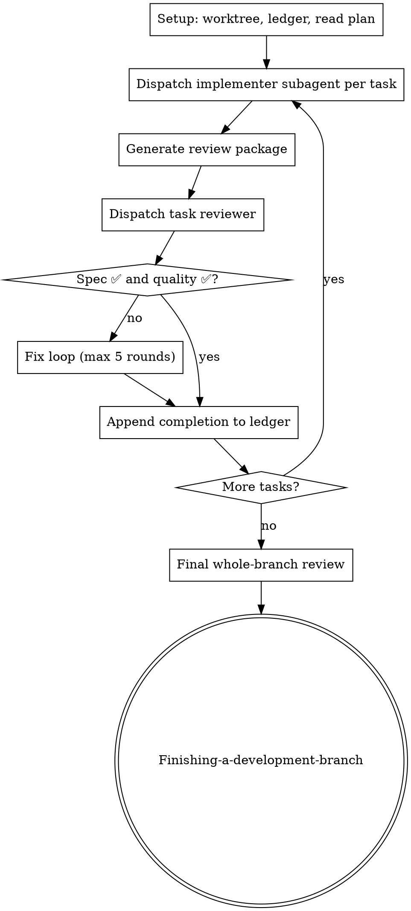

# Subagent-Driven Development

> **Sumber:** Diadaptasi dari `obra/superpowers` (MIT).

Eksekusi plan dengan dispatch fresh subagent per task, task review (spec compliance + code quality) setelah setiap task, dan broad whole-branch review di akhir.

**Core principle:** Fresh subagent per task + task review + broad final review = high quality, fast iteration.

**Integrasi Niumination:** Ini adalah **layer orchestration** — melengkapi `writing-plans` (plan) dan `requesting-code-review` (review). Bekerja dengan agent swarm Hermes.

## The Process

## Model Selection

| Task Type | Model Tier |
|-----------|-----------|
| Mechanical (1-2 files, complete spec) | Fast, cheap |
| Integration (multi-file, coordination) | Standard |
| Architecture & design | Most capable |
| Final review | Most capable |
| Fix loop rounds 4-5 | One tier above stuck implementer |

## The Task Loop

### 1. Dispatch Implementer

- Run `task-brief` script untuk extract task text
- Dispatch prompt harus mengandung: (1) konteks task, (2) path brief, (3) interfaces dari task sebelumnya, (4) path report file
- Jangan paste accumulated history ke dispatch
- Record BASE commit sebelum dispatch

### 2. Handle Report

Implementer report status:
- **DONE:** Generate review package, dispatch reviewer
- **DONE_WITH_CONCERNS:** Baca concerns, address sebelum review
- **NEEDS_CONTEXT:** Provide missing context, re-dispatch
- **BLOCKED:** Assess blocker, eskalasi ke human jika perlu

### 3. Review Task

- **Wajib** — jangan skip
- Reviewer dapat: brief path, report path, review package, global constraints
- Output: spec compliance ✅/❌ + quality assessment

### 4. Fix Loop

- Rounds 1-3: Resume original implementer
- Rounds 4-5: Fresh implementer, more capable model
- Max 5 rounds per task
- Re-review scoped ke fix diff only

### 5. Complete Task

Ledger entry: `Task <N>: complete (commits <base>..<head>, review clean)`

## Final Review

- Whole-branch review via `requesting-code-review`
- Satu fix dispatch untuk semua findings
- Satu scoped re-review
- Adjudicate residual findings

## Finish

- Hapus workspace (`rm -rf <workspace>`)
- Panggil `finishing-a-development-branch`

## Integrasi Ekosistem

| Skill | Hubungan |
|-------|----------|
| `writing-plans` | **Input:** plan untuk dieksekusi |
| `verification-before-completion` | Verifikasi tiap task sebelum complete |
| `requesting-code-review` | Final review menggunakan skill ini |
| `finishing-a-development-branch` | **Output:** cleanup setelah semua selesai |
| `ponytail-core` | Subagent harus kode minimal — YAGNI |
